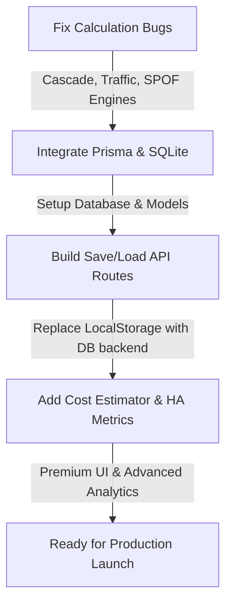

# StructFlow (Senkai) — Comprehensive Technical Audit & Project Improvement Report

This document outlines the bugs and calculation errors identified in the current **StructFlow (Senkai)** architecture analysis engines, detailed solutions for each, a concrete blueprint for integrating a database, and exciting product-grade features to transition this into a premium, market-ready SaaS application.

---

## 1. Deep Dive: Calculation Bugs & Engine Audits

We inspected the core graph and traffic simulation engines in the `backend/engine/` folder. Multiple critical logic bugs were found that completely break cascade failure analysis and skew traffic stress test results.

### Bug A: Broken Cascade Failure Analysis (Always Returns `[]`)
* **Location**: [cascadeEngine.js](file:///c:/Projects/StructFlow/backend/engine/cascadeEngine.js) & [graphUtils.js](file:///c:/Projects/StructFlow/backend/engine/graphUtils.js)
* **The Problem**: 
  In `cascadeEngine.js`, `simulateCascadeFailure` runs a depth-first search (`dfsWithFailed`) starting from each service to see if it can reach the `failedService`. If `visited.has(failedService)` is true, the service is added to the `affected` list.
  However, in `graphUtils.js`, `dfsWithFailed` is implemented as:
  ```javascript
  function dfsWithFailed(node, graph, failed, visited) {
      if (visited.has(node)) return;
      visited.add(node);
      const neighbors = graph[node] || [];
      neighbors.forEach(n => {
          if (!failed.has(n)) dfsWithFailed(n, graph, failed, visited);
      });
  }
  ```
  Because of the check `if (!failed.has(n))`, **the traversal explicitly avoids ever visiting the failed node!** Therefore, `failedService` is never added to the `visited` set, `visited.has(failedService)` is *always* false, and `cascadedFailures` always returns empty.
* **The Solution**: 
  We should allow the traversal to reach the failed service (and mark it as visited) but *stop* traversing further from it. We can rewrite `dfsWithFailed` like this:
  ```javascript
  function dfsWithFailed(node, graph, failed, visited) {
      if (visited.has(node)) return;
      visited.add(node);
      
      // If this node itself is failed, stop traversing its outgoing edges
      if (failed.has(node)) return;

      const neighbors = graph[node] || [];
      neighbors.forEach(n => {
          dfsWithFailed(n, graph, failed, visited);
      });
  }
  ```

---

### Bug B: Exponential Traffic Inflation & "Double-Counting" in Simulation
* **Location**: [trafficEngine.js](file:///c:/Projects/StructFlow/backend/engine/trafficEngine.js) & [trafficTimeEngine.js](file:///c:/Projects/StructFlow/backend/engine/trafficTimeEngine.js)
* **The Problem**: 
  Both traffic engines use a queue-based Breadth-First Search (BFS) to propagate load from the entry point down the dependency graph. 
  ```javascript
  while (queue.length > 0) {
      const current = queue.shift();
      ...
      const currentLoad = nodeLoad[current] || 0;
      for (const { to, percentage } of neighbors) {
          const trafficToChild = currentLoad * (percentage / 100);
          nodeLoad[to] += trafficToChild;
          queue.push(to);
      }
  }
  ```
  If a node has multiple incoming edges (e.g. `order-service` calls `postgres` and `user-service` calls `postgres`), the target node (`postgres`) gets pushed to the queue multiple times.
  * The first time `postgres` is popped, it propagates its *entire accumulated load* to its children (e.g., `postgres-replica`).
  * The second time `postgres` is popped, it propagates its *entire accumulated load* to its children **again**!
  
  This double-counting causes exponential traffic inflation down the graph. A 100 RPS request at the gateway can easily multiply into thousands of virtual RPS at the databases, giving completely wrong utilization and bottleneck metrics.
* **The Solution**:
  For Directed Acyclic Graphs (DAGs), we could use a **Topological Sort** to ensure a node only propagates traffic after *all* its incoming traffic has been fully accumulated. 
  To support both DAGs and cyclic dependencies (e.g., retry loops or database write-back), the most robust mathematical approach is a **relaxation algorithm** (similar to Jacobi/Gauss-Seidel solvers for linear systems):
  ```javascript
  // Relaxation method to solve: Load(j) = Entry(j) + Sum(Load(i) * P(i->j))
  let nodeLoad = {};
  nodes.forEach(n => nodeLoad[n.id] = n.id === entryNode ? totalTraffic : 0);

  const maxIterations = 50;
  const epsilon = 0.1;
  
  for (let iter = 0; iter < maxIterations; iter++) {
      const nextLoad = {};
      nodes.forEach(n => nextLoad[n.id] = n.id === entryNode ? totalTraffic : 0);

      edges.forEach(edge => {
          const from = edge.source || edge.from;
          const to = edge.target || edge.to;
          const pct = Number(edge.percentage ?? edge.data?.percentage) || 0;
          if (nodeLoad[from] > 0 && pct > 0) {
              nextLoad[to] += nodeLoad[from] * (pct / 100);
          }
      });

      // Check convergence
      let maxDiff = 0;
      nodes.forEach(n => {
          maxDiff = Math.max(maxDiff, Math.abs(nextLoad[n.id] - nodeLoad[n.id]));
      });

      nodeLoad = nextLoad;
      if (maxDiff < epsilon) break;
  }
  ```

---

### Bug C: Static Entry Point Hardcoding
* **Location**: [spof.js](file:///c:/Projects/StructFlow/backend/engine/spof.js) & [latencyEngine.js](file:///c:/Projects/StructFlow/backend/engine/latencyEngine.js)
* **The Problem**:
  * `spof.js` assumes the first node in the array (`nodes[0].id`) is the entry point. However, nodes in visual builders are ordered by when they are added or rearranged. If `nodes[0]` is a database, SPOF calculations fail completely.
  * `latencyEngine.js` hardcodes `startNode = "api-gateway"` and falls back to `nodes[0].id`.
* **The Solution**:
  Pass the `entryNodeId` explicitly from the frontend to the backend `/api/analyze` request (just like we already do for the `/api/traffic` route), or implement a helper to intelligently discover the entry point by finding nodes of type `cdn`, `loadbalancer`, `api`, or nodes with `0` in-degree.

---

### Bug D: Unsafe Division by Zero and NaN Capacities
* **Location**: [weakPointEngine.js](file:///c:/Projects/StructFlow/backend/engine/weakPointEngine.js) & [stressTestEngine.js](file:///c:/Projects/StructFlow/backend/engine/stressTestEngine.js)
* **The Problem**:
  If capacity is set to `0` or left blank (causing `NaN`), equations like `utilization = load / capacity` produce `Infinity` or `NaN`. In `findWeakestService`, comparing `NaN < minRemaining` returns `false`, causing the engine to skip nodes or return broken metrics.
* **The Solution**:
  Enforce safe parsing and default fallbacks:
  ```javascript
  const capacity = Math.max(1, Number(node.capacity) || 100);
  const load = Math.max(0, Number(node.load) || 0);
  ```

---

## 2. Blueprint: Database Integration (Local SQLite + Prisma ORM)

Currently, the user's layouts are stored purely in the browser's local storage (`localStorage`). To make this a professional product, we will integrate a database so users can:
1. **Save/Load multiple architectures** with custom titles and descriptions.
2. **Access a template gallery** of pre-built systems (e.g. "Microservices with Kafka", "Three-Tier Web App").
3. **Share layouts** with teammates via unique URLs.
4. **Manage user accounts** with secure authentication.

### Why SQLite + Prisma?
* **Zero Configuration**: SQLite stores data in a local file, requiring no database installation or external services.
* **Type-Safe ORM**: Prisma provides exceptional developer experience, auto-migrations, and auto-generated TypeScript/JavaScript clients.
* **Production Ready**: Can easily migrate to PostgreSQL or MySQL later by changing a single line in the schema!

### Database Schema Design (`prisma/schema.prisma`)
```prisma
datasource db {
  provider = "sqlite"
  url      = "file:./dev.db"
}

generator client {
  provider = "prisma-client-js"
}

model User {
  id        String   @id @default(uuid())
  email     String   @unique
  password  String // Hashed using bcrypt
  name      String?
  projects  Project[]
  createdAt DateTime @default(now())
  updatedAt DateTime @updatedAt
}

model Project {
  id          String   @id @default(uuid())
  title       String
  description String?
  nodesJson   String // Stores React Flow nodes as a JSON string
  edgesJson   String // Stores React Flow edges as a JSON string
  riskScore   Int?
  userId      String?
  user        User?    @relation(fields: [userId], references: [id], onDelete: Cascade)
  createdAt   DateTime @default(now())
  updatedAt   DateTime @updatedAt
}
```

---

## 3. Product Roadmap: Improvements & Advanced Features

To transform StructFlow into a premium SaaS product that engineers and students will love, we propose the following feature set:

### A. Architectural Cost Estimator 💰
* **Concept**: System design is always limited by budget. Let's add financial intelligence!
* **Implementation**:
  * Users assign resource tiers to nodes (e.g., Database: "Small RDS - $15/mo", "Large Cluster - $250/mo").
  * Add a "Cost Calculator" widget to calculate estimated monthly costs.
  * AI Architect suggests cost-saving configurations (e.g., "You are over-provisioning this worker; downsize to save $45/mo").

### B. High Availability (HA) & Disaster Recovery Scoring 🛡️
* **Concept**: Detect whether the architecture is resilient to regional outages.
* **Implementation**:
  * Allow tagging nodes with regions/Availability Zones (e.g., `us-east-1a`, `us-east-1b`).
  * Check if databases have "Multi-AZ Replication" enabled.
  * Alert users if all traffic routes through a single region's load balancer without a failover gateway.

### C. Live Interactive Manual Failure Sandbox (Interactive Play Mode) 🎮
* **Concept**: Instead of a static "Simulate" click, let users toggle nodes "ON/OFF" in real-time.
* **Implementation**:
  * Clicking a node in "Play Mode" trips a circuit breaker or marks it as "Crashed".
  * The canvas dynamically animates the redirected traffic paths, queues building up on upstream services, and the cascading red alerts!

### D. Team Collaboration & Shareable Links 🔗
* **Concept**: Share a read-only or collaborative view of an architecture.
* **Implementation**:
  * Generate secure, shareable tokens.
  * Anyone with the link can view, run traffic simulations, and export the PDF report.

---

## 4. Immediate Execution Plan

Here is the step-by-step roadmap to implement this audit:



1. **Step 1**: Correct all logic bugs in `cascadeEngine.js`, `trafficEngine.js`, `trafficTimeEngine.js`, `spof.js`, and `latencyEngine.js` to ensure the mathematical foundation is 100% correct.
2. **Step 2**: Initialize Prisma and SQLite in the backend, run migrations, and create the schema.
3. **Step 3**: Create Express routes for creating, updating, listing, and deleting projects.
4. **Step 4**: Update the Next.js frontend to save/load layouts from the new backend API.
5. **Step 5**: Introduce premium features (Cost Estimator, Live Sandbox) to finish polishing.

---
*Audit Report compiled by Antigravity AI.*
